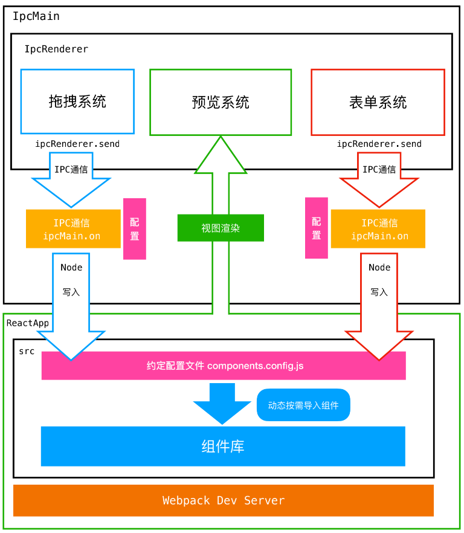
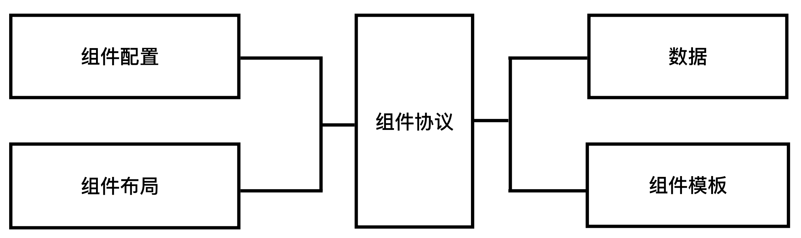
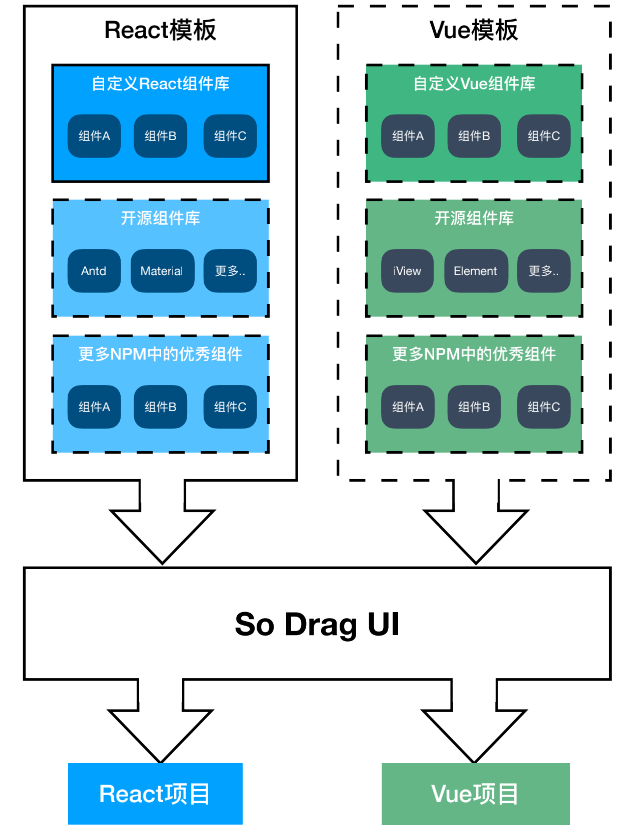

# So Drag UI

So 是一个可视化搭建平台

## 技术

Electron

Node

TypeScript

React（React Router，Redux）

Webpack

ESLint

## 系统架构

三大系统：拖拽系统，预览系统，表单系统

系统架构图如下：



## 基础

可视化搭建平台的实现基础

### 组件与模板



#### 组织页面

HTML标签是页面的最小单元，而组件是对 HTML结构、CSS样式、JS逻辑的封装

在 So 中组件将作为页面的基本单位，用户可以使用组件配合拖拽系统快速的制作页面

开发人员也可以通过对组件的封装和拓展来响应更多的业务场景

#### 特定的组件

使用特定的组件可以快速开发特定逻辑的页面，尤其对于活动页来讲

通过组件封装业务逻辑，并通过组件属性(Props)向外暴露组件的配置字段

由于采用组件化，以前复杂的页面通过可视化搭建就可以得到简化，页面开发只需要2个步骤：

- 组合搭配组件：页面就是各种组件的组合，用户只需要选取需要的组件
- 编辑组件配置：将对页面内容的编辑转化为对组件的配置属性(props)修改

#### 模板

由于组件化和前端框架强关联，React 和 Vue 之间并不能很好的互通

搭建平台本身的开发也要依靠前端框架。大部分平台和组件的框架是保持一致的，React搭建的平台只能产出React项目，也只能接受React组件的输入

这样就带来了限制，输出到还好，但是只能输入单一框架的组件的话，就失去了 npm 世界中绝大部分的优秀组件

这就需要将组件化的开发和平台本身解耦，So 使用模板的方式将组件化的逻辑分离出去，交给开发者独立开发维护




### 实时预览

#### 所见即所得

可视化的关键是能实时看到页面的实际效果

So 会在启动主程序时自动启动一个 webpack dev server，运行在本地的 3000 端口

Electron 启动后，会在主窗口以 webview 的形式加载这个本地服务

这个本地服务上运行的就是项目模板，由对应框架的 cli 生成并加以改动来支持实时预览的功能

简而言之，用户在主窗口的 webview 中看到的是真实的项目页面（开发环境）

#### 通信

拖拽，表单系统 和 预览系统的通信依靠 配置文件

配置文件是对当前页面中的组件的描述

格式如下：

```js
[
  {
    //组件id
    "id":1597199402807,
    //组件名称
    "name":"SoHeader",
    //组件数据(不同组件需要的数据并不相同)
    "data":{
      "title":"页面可视化搭建平台",
      "src":"xxxx",
      "link":"xxxxx"
    },
    //组件序号
    "index":0
  }
  //其他组件的配置...
]
```

### 页面生成

通过模板项目的打包命令生成一个标准的前端项目

还可以通过调整各个项目模板，进行更具体的优化

这一部分与可视化系统是完全解耦的


